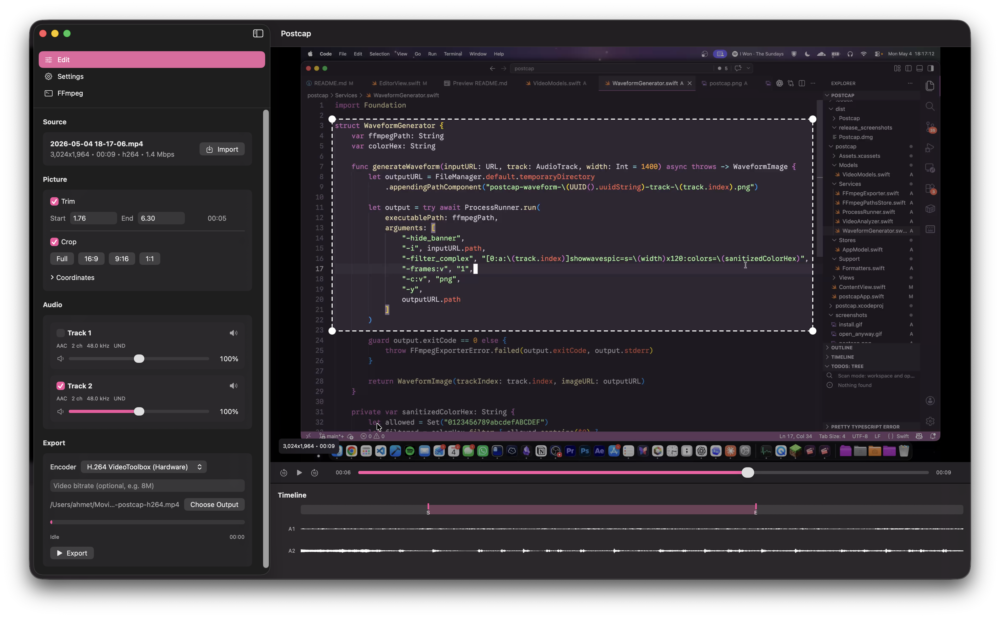
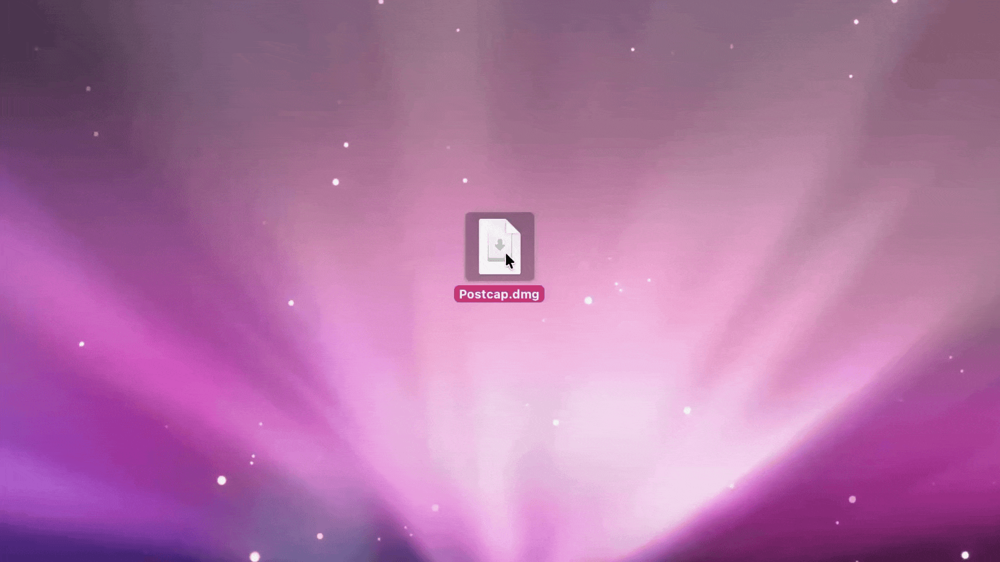

# Postcap

[](https://github.com/AhmetEsad/postcap/actions/workflows/release.yml)

Postcap es una aplicación nativa ligera para macOS diseñada para convertir grabaciones de pantalla sin procesar en clips compartibles: recortar, enmarcar, redimensionar, ajustar la velocidad de reproducción, limpiar las pistas de audio y exportar con ffmpeg.



Existe porque la grabadora de pantalla nativa de macOS ofrece una excelente captura por región, pero no graba el audio del sistema ni pistas de audio separadas. OBS proporciona un potente control de audio y fuentes, pero a menudo resulta engorroso para clips rápidos centrados en una región y generalmente aún requiere postprocesamiento. Los editores completos como Premiere son excesivos cuando solo quiero recortar una grabación, enmarcar la parte importante, corregir el audio y exportar.

Con Postcap, puedes importar un video, recortarlo, enmarcarlo en la región importante, redimensionar la salida, ajustar su velocidad, silenciar/eliminar/ajustar pistas de audio individuales (como micrófono frente a audio del sistema) y luego exportarlo a través de ffmpeg. Los codificadores de VideoToolbox acelerados por hardware están disponibles cuando son compatibles con la compilación de ffmpeg instalada.

## Requisitos

- macOS
- `ffmpeg` y `ffprobe` instalados por el usuario
- Xcode para compilaciones de desarrollo

ffmpeg y ffprobe no están incluidos por motivos de licencia. Postcap verifica automáticamente:

- `/opt/homebrew/bin/ffmpeg` y `/opt/homebrew/bin/ffprobe`
- `/usr/local/bin/ffmpeg` y `/usr/local/bin/ffprobe`

Si se encuentran en otra ubicación, selecciona las rutas de los binarios en la aplicación. Las rutas seleccionadas se guardan permanentemente.

## Instalación

Instala ffmpeg con Homebrew:

```sh
brew install ffmpeg
```

Descarga la última versión DMG desde [Releases](https://github.com/AhmetEsad/postcap/releases) y arrastra Postcap a Aplicaciones.



Para desarrollo, abre `postcap.xcodeproj` en Xcode y ejecuta el esquema `postcap`.

## Funcionalidades

- Importa archivos de video e inspecciona la duración, dimensiones, códecs, bitrate y pistas de audio con `ffprobe`
- Recorta con marcadores en la línea de tiempo, controles del reproductor o los atajos de teclado `I`/`O`
- Enmarca en una región con una superposición visual de recorte
- Redimensiona el video exportado
- Acelera o ralentiza las exportaciones manteniendo el tono del audio
- Muestra formas de onda de audio por pista en la línea de tiempo
- Genera formas de onda automáticamente para videos cortos o manualmente desde la configuración
- Incluye, elimina, silencia o ajusta el volumen de pistas de audio individuales
- Mezcla las pistas de audio seleccionadas en una sola pista de salida para compatibilidad con plataformas de mensajería y redes sociales
- Exporta con los códecs de ffmpeg disponibles, incluyendo VideoToolbox, ProRes y códecs de software cuando estén presentes en la compilación local de ffmpeg
- Actualización automática

## Uso

1. Inicia Postcap.
2. Confirma que las rutas de `ffmpeg` y `ffprobe` son válidas o selecciónalas manualmente.
3. Importa una grabación o arrástrala al panel de vista previa principal.
4. Configura las opciones de recorte, enmarcado, tamaño de salida, velocidad, códec, bitrate y pistas de audio.
5. Selecciona una ruta de salida.
6. Exporta.

Cuando se selecciona una sola pista de audio sin modificar, Postcap puede copiarla directamente. Las múltiples pistas seleccionadas se ajustan en volumen según la configuración, se mezclan y se exportan como una única pista AAC.

Atajos para recortar:

- `I`: establece el inicio del recorte en la cabeza de reproducción
- `O`: establece el final del recorte en la cabeza de reproducción
- `Shift-I`: ir al inicio del recorte
- `Shift-O`: ir al final del recorte

## Desarrollo

- `Services/FFmpegPathsStore.swift` detecta y guarda permanentemente las rutas de los binarios.
- `Services/VideoAnalyzer.swift` llama a `ffprobe` y analiza el JSON.
- `Services/FFmpegExporter.swift` construye arrays de argumentos para ffmpeg, ejecuta `Process` y analiza el progreso.
- `Services/HapticManager.swift` gestiona la retroalimentación háptica nativa opcional.
- `Stores/AppModel.swift` gestiona el estado del editor.
- `Views/` contiene el editor en SwiftUI.

Compila desde la línea de comandos:

```sh
xcodebuild -project postcap.xcodeproj -scheme postcap -configuration Debug build
```

Crea una compilación de lanzamiento local:

```sh
xcodebuild -project postcap.xcodeproj -scheme postcap -configuration Release -derivedDataPath .build/DerivedData build
```

La aplicación compilada se encontrará en `.build/DerivedData/Build/Products/Release/Postcap.app`.

Empaqueta un DMG local:

```sh
script/package_dmg.sh
```

Esto crea `dist/Postcap.dmg`.

El script de empaquetado requiere una identidad de firma Developer ID Application.

## Licencia

Postcap está licenciado bajo la Licencia MIT. Consulta [LICENSE](LICENSE) para más detalles.

Postcap no incluye ffmpeg ni ffprobe. Son dependencias externas y están licenciadas por separado por sus respectivos proyectos.
