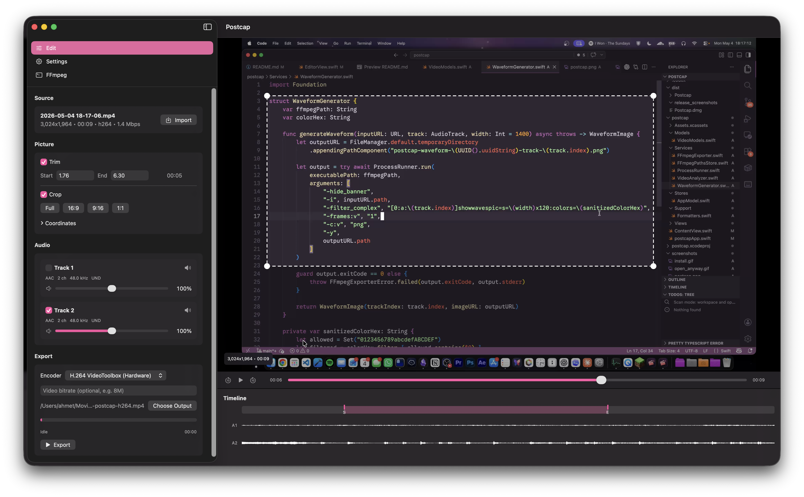
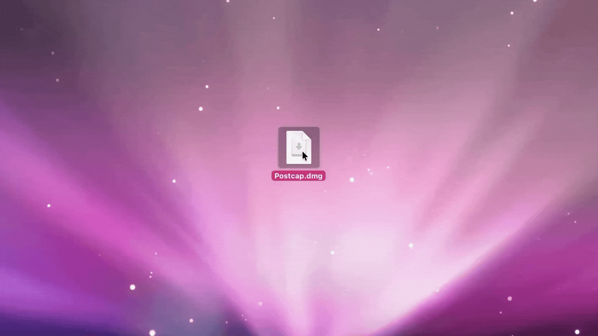

# Postcap

Postcap is a lightweight native macOS app for post-capture editing: trimming, cropping, cleaning up audio tracks, and exporting videos with ffmpeg.



It exists because the built-in macOS screen recorder has excellent region capture, but does not capture system audio or separate audio tracks. OBS has powerful audio and source control, but it is often annoying for quick region-focused clips and usually still needs post-processing. Full editors like Premiere are overkill when I just want to trim a recording, crop to the important part, fix the audio, and export.

With Postcap, you can simply import a video, trim it, crop to the important region, mute/remove/adjust individual audio tracks such as mic vs system audio, then export H.264 or H.265 through ffmpeg. Hardware-accelerated VideoToolbox encoders are used when available.

## Requirements

- macOS
- User-installed `ffmpeg` and `ffprobe`
- Xcode for development builds

ffmpeg and ffprobe are not bundled for licensing reasons. Postcap automatically checks:

- `/opt/homebrew/bin/ffmpeg` and `/opt/homebrew/bin/ffprobe`
- `/usr/local/bin/ffmpeg` and `/usr/local/bin/ffprobe`

If they are somewhere else, choose the binary paths in the app. The selected paths are persisted.

## Install

Install ffmpeg with Homebrew:

```sh
brew install ffmpeg
```

Download Postcap, drag it to Applications, and open it.



If you use an unsigned release build, macOS may show an "Unverified Developer" warning. Open **System Settings > Privacy & Security** and choose **Open Anyway** for Postcap. I don't currently have an Apple Developer license and this is expected for builds that are signed locally or ad hoc instead of notarized with an Apple Developer account.


For development, open `postcap.xcodeproj` in Xcode and run the `postcap` scheme.

## Features

- Import video files and inspect duration, dimensions, codecs, bitrate, and audio tracks with `ffprobe`
- Trim/cut by start and end time
- Crop to region with a visual crop overlay
- Show per-track audio waveforms in the timeline
- Generate waveforms automatically for short videos or manually from settings
- Include, remove, mute, or adjust volume for individual audio tracks
- Export with available ffmpeg encoders, including VideoToolbox, ProRes, and software encoders when present in the local ffmpeg build

## Usage

1. Launch Postcap.
2. Confirm `ffmpeg` and `ffprobe` paths are valid, or choose them manually.
3. Import a recording or drag it into the main preview.
4. Set trim, crop, encoder, bitrate, and audio track options.
5. Choose an output path.
6. Export.

When audio volume is unchanged, Postcap copies audio tracks. When any kept track has a volume adjustment, Postcap filters kept tracks and encodes them as AAC.

## Development

- `Services/FFmpegPathsStore.swift` detects and persists binary paths.
- `Services/VideoAnalyzer.swift` calls `ffprobe` and parses JSON.
- `Services/FFmpegExporter.swift` builds ffmpeg argument arrays, runs `Process` and parses progress.
- `Stores/AppModel.swift` owns editor state.
- `Views/` contains the SwiftUI editor.

Build from the command line:

```sh
xcodebuild -project postcap.xcodeproj -scheme postcap -configuration Debug build
```

Create a local release build:

```sh
xcodebuild -project postcap.xcodeproj -scheme postcap -configuration Release -derivedDataPath .build/DerivedData build
```

The built app will be at `.build/DerivedData/Build/Products/Release/Postcap.app`.

Package a local DMG:

```sh
script/package_dmg.sh
```

This creates `dist/Postcap.dmg`. The script uses ad hoc signing (`codesign --sign -`) and does not notarize the app. Users may need to approve the first launch from **System Settings > Privacy & Security**. For a fully trusted download without that warning, sign with an Apple Developer ID certificate and notarize the DMG with Apple.